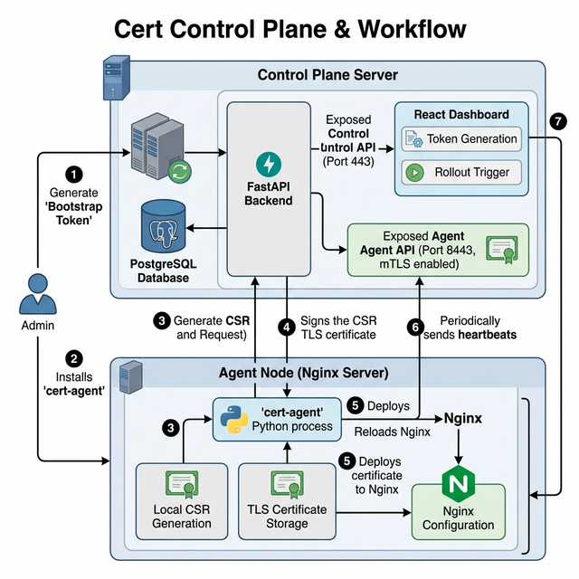

# Cert Control Plane

TLS 证书生命周期管理系统 —— 控制面板 + nginx 节点 Agent。

## 架构概览



### 双端口隔离

| 端口 | 用途 | 认证方式 |
|------|------|---------|
| **443** | Control API (运维管理) | `X-Admin-API-Key` 请求头 |
| **8443** | Agent API (节点通信) | mTLS 客户端证书 |

- 443 端口**禁止**访问 Agent API（nginx 直接返回 403）
- 8443 端口强制 mTLS，`/register` 除外（bootstrap 阶段无证书）
- 证书 bundle 仅通过 8443 mTLS 端口下载，运维侧无私钥暴露

## 技术栈

- **后端**: FastAPI + Pydantic v2 + async SQLAlchemy 2.0
- **数据库**: PostgreSQL (asyncpg 驱动)
- **迁移**: Alembic (async)
- **调度**: APScheduler (Rollout 批次推进)
- **加密**: cryptography (CA 签发、CSR 验证、Fernet 密钥加密)
- **代理**: nginx (mTLS 反向代理)
- **Agent**: httpx + cryptography (运行在 nginx 节点)

## 快速开始

### ⚡ 一键启动（推荐）

**Windows (PowerShell)：**
```powershell
.\startup.ps1
```

**Linux / macOS：**
```bash
bash start.sh
```

脚本会自动完成：检查依赖 → 生成 `.env` 密钥 → 创建 CA 证书 → 启动后端 + 前端。启动后终端会显示 `ADMIN_API_KEY`，打开前端页面输入即可。

---

### 手动启动

#### 1. 生成 CA 和服务端证书

```bash
pip install cryptography
python scripts/init_ca.py --out-dir ./certs
```

#### 2. 配置环境变量

```bash
cp .env.example .env
```

编辑 `.env` 并填入：

```bash
# 必填：生成 Fernet 密钥
CA_KEY_ENCRYPTION_KEY=$(python -c "from cryptography.fernet import Fernet; print(Fernet.generate_key().decode())")

# 必填：生成 Admin API Key
ADMIN_API_KEY=$(python -c "import secrets; print(secrets.token_hex(32))")
```

#### 3. 启动服务

```bash
# Docker 方式
docker-compose up -d

# 或本地开发方式 (SQLite)
uvicorn app.main:app --host 127.0.0.1 --port 8000
```

服务启动后：
- 控制 API：`https://localhost:443`
- API 文档：`https://localhost:443/docs`
- 健康检查：`https://localhost:443/healthz`
- Agent API：`https://localhost:8443`（需 mTLS）

### 5. 访问 Web 仪表盘 (Dashboard)

本项目原生提供基于 React 的可视化仪表盘。

1. 进入前端目录并构建静态资源：
   ```bash
   cd frontend
   npm install
   npm run build
   ```
   > FastAPI 会自动服务 `frontend/dist` 目录。
2. 在浏览器中打开 `https://localhost:443/dashboard`
3. 弹窗提示输入 `API Key`，请填入 `.env` 中的 `ADMIN_API_KEY` 以解锁面板。
4. 面板每 30 秒自动刷新，展示 Agent 状态、证书过期警告与操作审计。

### 4. 部署 Agent 到 nginx 节点

详见 [Agent 部署](#agent-部署) 章节。

## API 文档

启动服务后访问 `https://<host>/docs` (Swagger) 或 `https://<host>/redoc` (ReDoc)。

### Agent API (端口 8443, mTLS)

| 方法 | 路径 | 说明 |
|------|------|------|
| POST | `/api/agent/register` | Agent 首次注册（bootstrap token + CSR） |
| GET | `/api/agent/bundle` | 下载证书 Bundle (PEM) |
| POST | `/api/agent/renew` | 证书续期（提交新 CSR） |
| POST | `/api/agent/heartbeat` | 心跳上报 + 查询待执行操作 |

### Control API (端口 443, Admin API Key)

**Agent 管理**

| 方法 | 路径 | 说明 |
|------|------|------|
| POST | `/api/control/agents` | 预注册 Agent (返回 bootstrap_token) |
| GET | `/api/control/agents` | Agent 列表 (分页) |
| GET | `/api/control/agents/{id}` | 查询单个 Agent |
| DELETE | `/api/control/agents/{id}` | 删除 Agent |
| POST | `/api/control/agents/{id}/reset-token` | 重置 Bootstrap Token (用于重新注册) |

**证书管理**

| 方法 | 路径 | 说明 |
|------|------|------|
| GET | `/api/control/agents/{id}/certs` | Agent 证书历史 |
| GET | `/api/control/certs/{id}` | 查询单张证书 |
| POST | `/api/control/certs/{id}/revoke` | 撤销证书 |

**Rollout 批量轮换**

| 方法 | 路径 | 说明 |
|------|------|------|
| POST | `/api/control/rollouts` | 创建 Rollout |
| GET | `/api/control/rollouts` | Rollout 列表 |
| GET | `/api/control/rollouts/{id}` | Rollout 详情 (含 Agent 执行状态) |
| POST | `/api/control/rollouts/{id}/start` | 启动 Rollout |
| POST | `/api/control/rollouts/{id}/pause` | 暂停 Rollout |
| POST | `/api/control/rollouts/{id}/resume` | 恢复 Rollout |
| POST | `/api/control/rollouts/{id}/rollback` | 回滚 Rollout |

**审计日志**

| 方法 | 路径 | 说明 |
|------|------|------|
| GET | `/api/control/audit` | 查询审计日志 (分页) |

## 证书续期流程 (CSR 模式)

私钥始终在 Agent 节点本地生成，**永远不离开节点**。

```
运维人员                    控制面板                         Agent 节点
    │                         │                               │
    │  POST /control/agents   │                               │
    │  (预注册, 获取 token)    │                               │
    ├────────────────────────►│                               │
    │  ◄── bootstrap_token    │                               │
    │                         │                               │
    │  (把 token 配置到节点)    │                               │
    │─ ─ ─ ─ ─ ─ ─ ─ ─ ─ ─ ─ ─ ─ ─ ─ ─ ─ ─ ─ ─ ─ ─ ─ ─ ─►│
    │                         │    POST /agent/register        │
    │                         │    (token + CSR)               │
    │                         │◄──────────────────────────────┤
    │                         │    ──► cert_pem + chain_pem    │
    │                         │──────────────────────────────►│
    │                         │                               │ 部署到 nginx
    │                         │                               │
    │                         │    POST /agent/heartbeat       │
    │                         │◄──────────────────────────────┤  (每30秒)
    │                         │    ──► pending_action: null     │
    │                         │──────────────────────────────►│
    │                         │                               │
    │  POST /rollouts (创建)   │                               │
    │  POST /rollouts/{id}/start                              │
    ├────────────────────────►│                               │
    │                         │  Orchestrator tick:            │
    │                         │  items → IN_PROGRESS           │
    │                         │                               │
    │                         │    POST /agent/heartbeat       │
    │                         │◄──────────────────────────────┤
    │                         │    ──► pending_action: "renew"  │
    │                         │──────────────────────────────►│
    │                         │                               │ 生成新密钥+CSR
    │                         │    POST /agent/renew           │
    │                         │    (新 CSR)                    │
    │                         │◄──────────────────────────────┤
    │                         │  签发新证书                     │
    │                         │  item → COMPLETED              │
    │                         │    ──► new cert_pem            │
    │                         │──────────────────────────────►│
    │                         │                               │ 部署新证书到 nginx
```

### Rollout 批次推进

1. 创建 Rollout → 按 `batch_size` 将目标 Agent 分为多个批次
2. 启动 Rollout → 编排器标记第 1 批次的 items 为 `IN_PROGRESS`
3. Agent 心跳发现 `pending_action=renew` → 提交新 CSR → 获取新证书 → 部署
4. `/renew` 端点自动将 rollout_item 标记为 `COMPLETED`
5. 编排器检测到当前批次**全部完成**后，推进下一批次
6. 超时未完成的 item 自动标记为 `FAILED`（默认 10 分钟）

支持的操作：**暂停** / **恢复** / **回滚**（恢复到旧证书）

## Agent 部署

Agent 是一个独立的 Python 进程，运行在每个 nginx 节点上。

### ⚡ 一键安装（推荐）

**Linux (在 nginx 节点上)：**
```bash
# 交互式安装 — 脚本会提示输入控制面板地址、Agent 名称和 Token
sudo bash agent/scripts/install.sh

# 或非交互式
sudo bash agent/scripts/install.sh \
  --cp-url https://cp.example.com:8443 \
  --name web-node-01 \
  --token <bootstrap_token>
```

**Windows (管理员 PowerShell)：**
```powershell
.\agent\scripts\install.ps1

# 或非交互式
.\agent\scripts\install.ps1 -CpUrl "https://cp.example.com:8443" -AgentName "web-node-01" -Token "<token>"
```

脚本会自动：检查依赖 → 安装代码 → 安装 Python 包 → 生成配置 → 复制 CA 证书 → 注册系统服务。

### 手动安装

```bash
# 1. 复制 agent 代码
sudo mkdir -p /opt/cert-agent
sudo cp -r agent/ /opt/cert-agent/

# 2. 安装依赖
pip3 install httpx cryptography

# 3. 配置
sudo mkdir -p /etc/cert-agent
sudo cp agent/agent.env.example /etc/cert-agent/agent.env
sudo chmod 600 /etc/cert-agent/agent.env
# 编辑 /etc/cert-agent/agent.env

# 4. 复制 CA 证书
sudo cp certs/ca.crt /etc/cert-agent/ca.crt

# 5. 安装 systemd 服务
sudo cp agent/cert-agent.service /etc/systemd/system/
sudo systemctl daemon-reload
sudo systemctl enable --now cert-agent
```

### 配置项

| 环境变量 | 必填 | 默认值 | 说明 |
|---------|------|--------|------|
| `CERT_AGENT_CP_URL` | 是 | - | 控制面板地址 (如 `https://cp.example.com:8443`) |
| `CERT_AGENT_CA_CERT` | 是 | - | CA 证书路径 |
| `CERT_AGENT_NAME` | 是 | - | Agent 名称 (须与控制面板预注册名称一致) |
| `CERT_AGENT_BOOTSTRAP_TOKEN` | 首次 | - | 一次性注册令牌 |
| `CERT_AGENT_STATE_DIR` | 否 | `/var/lib/cert-agent` | 本地状态目录 |
| `CERT_AGENT_NGINX_CERT_DIR` | 否 | `/etc/nginx/certs` | nginx 证书目录 |
| `CERT_AGENT_NGINX_RELOAD_CMD` | 否 | `nginx -s reload` | nginx 重载命令 |
| `CERT_AGENT_HEARTBEAT_INTERVAL` | 否 | `30` | 心跳间隔 (秒) |
| `CERT_AGENT_RENEW_BEFORE_DAYS` | 否 | `7` | 过期前 N 天主动续期 |
| `CERT_AGENT_MAX_AUTH_FAILURES` | 否 | `3` | 连续认证失败 N 次后尝试重新注册 |

### Agent 容错机制

- **本地过期检测**: 每次心跳前检查证书有效期，过期前 7 天（可配置）自动续期，不依赖控制面板指令
- **mTLS 失败恢复**: 连续认证失败超过阈值后自动尝试重新注册；若无 bootstrap token 则输出操作指引日志
- **续期回滚**: 续期失败时自动恢复旧证书和密钥

### 管理命令

```bash
systemctl start cert-agent    # 启动
systemctl stop cert-agent     # 停止
systemctl status cert-agent   # 状态
journalctl -u cert-agent -f   # 实时日志
```

## 项目结构

```
cert-control-plane/
├── startup.ps1                 # ⚡ 一键启动 (Windows)
├── start.sh                    # ⚡ 一键启动 (Linux/macOS)
├── app/                        # 控制面板后端
│   ├── main.py                 # FastAPI 入口 + lifespan
│   ├── config.py               # 环境变量配置 (pydantic-settings)
│   ├── database.py             # async SQLAlchemy 引擎 + session
│   ├── models.py               # ORM 模型 (Agent/Certificate/Rollout/AuditLog)
│   ├── schemas.py              # Pydantic 请求/响应 schema
│   ├── api/
│   │   ├── agent.py            # Agent API (register/bundle/renew/heartbeat)
│   │   ├── control.py          # Control API (agents/certs/rollouts/audit)
│   │   └── dashboard.py        # Dashboard API (summary/agents-health/certs-expiry/events)
│   ├── core/
│   │   ├── crypto.py           # CA 加载、CSR 签发、Fernet 加解密
│   │   ├── security.py         # Admin API Key 校验、bootstrap token 生成
│   │   └── audit.py            # 审计日志写入
│   ├── registry/
│   │   └── store.py            # 证书 CRUD (issue_from_csr/revoke/build_bundle)
│   └── orchestrator/
│       └── rollout.py          # Rollout 编排 (批次推进/暂停/恢复/回滚)
├── frontend/                   # React Web Dashboard (Vite + TailwindCSS)
│   ├── src/
│   │   ├── App.tsx             # 主应用 (认证状态管理)
│   │   ├── index.css           # 深色玻璃拟物风格主题
│   │   └── components/
│   │       ├── AuthScreen.tsx   # API Key 登录界面
│   │       └── Dashboard.tsx    # 仪表盘主面板
│   ├── vite.config.ts          # Vite 配置 (含 API 代理)
│   └── package.json
├── agent/                      # nginx 节点 Agent (独立部署)
│   ├── __main__.py             # 入口 (python -m agent)
│   ├── config.py               # Agent 配置 (环境变量)
│   ├── crypto.py               # 密钥生成 + CSR 构建
│   ├── client.py               # httpx mTLS 客户端
│   ├── runner.py               # 主循环 (注册/心跳/续期/容错)
│   ├── deployer.py             # 证书部署到 nginx + reload
│   ├── cert-agent.service      # systemd 服务文件
│   ├── agent.env.example       # 环境变量模板
│   └── scripts/
│       ├── install.sh          # ⚡ Agent 一键安装 (Linux)
│       └── install.ps1         # ⚡ Agent 一键安装 (Windows)
├── tests/                      # 回归测试 (无需数据库)
│   ├── conftest.py             # 测试 fixtures
│   ├── test_agent_auth.py      # Agent 认证测试
│   ├── test_dashboard.py       # Dashboard API 测试
│   ├── test_serial_hex.py      # 证书序列号测试
│   ├── test_audit_actions.py   # 审计动作测试
│   ├── test_migration.py       # 迁移文件测试
│   └── test_installer.py       # 安装脚本测试
├── alembic/                    # 数据库迁移
│   ├── env.py
│   └── versions/
│       ├── 001_initial.py      # 初始 schema
│       └── 002_serial_hex_compat.py  # 旧版 DB 兼容迁移
├── nginx/
│   └── nginx.conf              # 双端口 mTLS 配置
├── scripts/
│   └── init_ca.py              # CA + 服务端证书生成工具
├── docker-compose.yml
├── Dockerfile
├── pyproject.toml              # 控制面板依赖
├── alembic.ini
└── .env.example
```

## 安全设计

- **私钥不出节点**: CSR 模式下，Agent 在本地生成 RSA 私钥，只提交 CSR 给控制面板
- **mTLS 双向认证**: Agent API 端口 (8443) 强制验证客户端证书
- **端口隔离**: 443 端口无法访问 Agent 端点，防止运维侧绕过 mTLS 下载 bundle
- **证书序列号绑定 (fail-closed)**: Agent 认证同时校验 `X-Client-CN` 和 `X-Client-Serial`，两者缺一不可；序列号必须与 DB 中当前证书匹配
- **运行时吊销**: 吊销后的证书立即被拒绝，不仅是 DB 标记
- **Header 防伪**: 443 端口主动清除 `X-Client-CN` / `X-Client-Serial` / `X-Client-Verified` 头
- **Bootstrap Token**: 一次性使用，注册后立即作废；支持过期时间（默认 24 小时）
- **密钥加密存储**: 服务端生成的私钥使用 Fernet 加密后存入数据库
- **systemd 加固**: `NoNewPrivileges=true`, `ProtectSystem=strict`, `ProtectHome=true`
- **审计日志**: 所有写操作记录到 `audit_logs` 表，不可修改

## 环境变量 (控制面板)

| 变量 | 必填 | 默认值 | 说明 |
|------|------|--------|------|
| `DATABASE_URL` | 否 | `postgresql+asyncpg://...` | 数据库连接 |
| `CA_KEY_ENCRYPTION_KEY` | 是 | - | Fernet 密钥 (加密存储私钥) |
| `ADMIN_API_KEY` | 是 | - | Control API 认证密钥 |
| `CA_CERT_PATH` | 否 | `/certs/ca.crt` | CA 证书路径 |
| `CA_KEY_PATH` | 否 | `/certs/ca.key` | CA 私钥路径 |
| `CERT_VALIDITY_DAYS` | 否 | `365` | 签发证书有效期 (天) |
| `BOOTSTRAP_TOKEN_EXPIRE_HOURS` | 否 | `24` | Bootstrap token 过期时间 |
| `STRICT_CA_STARTUP` | 否 | `true` | CA 缺失时是否中断启动 (dev 可设 false) |
| `ROLLOUT_INTERVAL_SECONDS` | 否 | `30` | 编排器轮询间隔 |
| `ROLLOUT_ITEM_TIMEOUT_MINUTES` | 否 | `10` | Rollout item 超时时间 |

## 数据库迁移

```bash
# 全新部署
alembic upgrade head

# 从旧版 (serial BIGINT) 升级
# 002 迁移会自动检测 schema 状态：
#   - 已有 serial_hex → no-op
#   - 仅有 serial BIGINT → 添加 serial_hex + 回填 + 约束
alembic upgrade head
```

旧版数据库升级后验证：

```sql
-- 确认无空值
SELECT COUNT(*) FROM certificates WHERE serial_hex IS NULL;  -- 应返回 0

-- 确认无重复
SELECT serial_hex, COUNT(*) FROM certificates
GROUP BY serial_hex HAVING COUNT(*) > 1;  -- 应返回空
```

## 开发

```bash
# 安装依赖
pip install -e ".[dev]"

# 启动数据库
docker-compose up -d db

# 运行迁移
alembic upgrade head

# 启动开发服务器
uvicorn app.main:app --reload --host 0.0.0.0 --port 8000

# 运行测试 (无需数据库)
pytest tests/ -v
```

### 前端开发 (Web Dashboard)

前端位于 `frontend/` 目录，采用了 React + Vite + TailwindCSS 架构。

```bash
cd frontend
npm install

# 启动带热重载的开发服务器 (默认 http://localhost:5173)
npm run dev
```

开发服务器会自动通过代理将 `/api/` 请求转发给运行在 `443` 端口的本地 FastAPI 实例（需确保证书忽略等设置妥当，见 `vite.config.ts`）。
