# 自测报告

## 真实 OrbStack 联调测试报告

### 环境信息

| 项目 | 值 |
|------|-----|
| Docker context | orbstack |
| Compose 服务 | db, app |
| 数据库 | PostgreSQL 16-alpine |
| Control/API 地址 | http://localhost:8080 |
| Agent API 暴露端口 | http://localhost:8081 |
| 临时真实边缘节点 | certcp-edge-realtest |
| 边缘节点 HTTPS | https://localhost:9446 |

### 执行结果

| 指标 | 值 |
|------|-----|
| 总用例数 | 12 |
| 通过 | 9 |
| 失败 | 3 |
| 跳过 | 0 |

### 用例执行详情

| 测试用例 | 操作步骤 | 结果 |
|----------|----------|------|
| TC-E2E-001 Compose 启动 | `docker compose up -d --build db app` | 通过 |
| TC-E2E-002 数据库健康检查 | `GET /healthz` | 通过，返回 `{"status":"ok","db":"connected"}` |
| TC-E2E-003 Agent 注册审批 | `POST /api/agent/register` -> `POST /api/control/agents/{id}/approve` -> `GET /api/agent/register/status` | 通过 |
| TC-E2E-004 外部证书上传 | 生成真实 RSA 私钥和自签 PEM 证书，调用 `POST /api/control/external-certs` | 通过 |
| TC-E2E-005 证书分配 | `POST /api/control/agents/{id}/assign-cert` | 通过 |
| TC-E2E-006 Agent 拉取证书 | `POST /api/agent/heartbeat` -> `POST /api/agent/fetch-certs` | 通过，返回真实 `cert_pem` 和 `key_pem` 更新 |
| TC-E2E-007 Agent 上报部署结果 | `POST /api/agent/report-certs` -> `GET /api/control/agents/{id}/certs` | 通过，证书记录落库 |
| TC-E2E-008 真实边缘节点部署 | 临时 Docker 边缘节点运行 nginx + Python Agent，审批后拉取并写入 `/etc/nginx/certs/api.example.com.crt` | 通过，容器内证书 serial 匹配 |
| TC-E2E-009 边缘 HTTPS 验证 | `curl -sk https://localhost:9446` + `openssl s_client` | 通过，HTTPS 返回 `edge-node`，证书 `CN=api.example.com` |
| TC-E2E-010 Agent 独立端口 | `curl http://localhost:8081/api/agent/register` | 失败，返回 empty reply；当前 compose 只启动了 8000 的 uvicorn |
| TC-E2E-011 仓库 live smoke 脚本 | `bash tools/agent-smoke/run-live-smoke.sh` | 失败，脚本引用不存在的 compose service `nginx` |
| TC-E2E-012 前端 Dashboard 数据展示 | 浏览器打开 `http://localhost:8080/dashboard` | 失败，生产前端能加载但默认使用 `dev-mode-bypass`，真实 Control API 不接受该 key，页面显示空数据 |

### 关键证据

| 项目 | 值 |
|------|-----|
| 真实边缘 Agent | `edge-realtest-codex` |
| 边缘节点部署证书 serial | `3BEDD471EBDF3FE2C2FCF9C08D3D859660DFE8A6` |
| 边缘节点证书 subject | `CN=api.example.com` |
| 边缘节点证书有效期 | `Apr 24 16:03:55 2026 GMT` 到 `Jun 23 16:08:55 2026 GMT` |
| Dashboard API 汇总 | agents total=13, active=13, certificates total_active=12 |

### 失败详情

1. `docker-compose.yml` 将 `8081` 映射到容器 `8001`，但当前 app command 只启动 `uvicorn app.main:app --port 8000`，所以 Agent 独立端口不可用。
2. `tools/agent-smoke/run-live-smoke.sh` 执行 `docker compose up -d --build app nginx`，但当前 compose 文件没有 `nginx` service，脚本无法运行。
3. `server/frontend/src/App.tsx` 在没有 session key 时默认设置 `dev-mode-bypass`，但后端 Control API 仍要求真实 `X-Admin-API-Key`，导致生产 Dashboard 加载后展示空数据。

### 2026-05-06 单端口整改记录

本次整改采用“无控制面 nginx、单端口入口”的部署方案：

- `docker-compose.yml` 只暴露 `8080:8000`，Dashboard、Control API、Agent API 共用该入口。
- `server/Dockerfile` 只启动一个 `uvicorn app.main:app --port 8000` 进程。
- `tools/agent-smoke/run-live-smoke.sh` 不再引用不存在的 compose `nginx` service。
- `server/frontend/src/App.tsx` 不再默认写入 `dev-mode-bypass`，无真实 Admin API Key 时进入登录页。

状态：代码与文档已调整，等待 OrbStack Docker socket 恢复后执行完整容器复测并更新用例状态。

### 敏感信息处理

- 自测报告未记录 Admin API Key、Agent Token、私钥内容。
- API 测试中使用了真实证书私钥，但只在本地 OrbStack 环境内传递，并验证服务端能返回给已审批 Agent。

## 多 Agent 扩展联调测试报告

### 环境信息

| 项目 | 值 |
|------|-----|
| 执行时间 | 2026-04-24 16:16 UTC |
| 新增边缘节点 | blue, green, multi-path, bad-reload |
| 新增容器 | `certcp-edge-blue-20260424161602`, `certcp-edge-green-20260424161602`, `certcp-edge-multi-20260424161602`, `certcp-edge-badreload-20260424161602` |
| HTTPS 端口 | 9447, 9448, 9449, 9450 |
| Control/API 地址 | http://localhost:8080 |
| 数据库 | OrbStack PostgreSQL 容器 |

### 执行结果

| 指标 | 值 |
|------|-----|
| 总用例数 | 10 |
| 通过 | 10 |
| 失败 | 0 |
| 跳过 | 0 |

### 用例执行详情

| 测试用例 | 操作步骤 | 结果 |
|----------|----------|------|
| TC-MULTI-001 多 Agent 启动注册 | 启动 4 个真实 nginx + Python Agent 容器，等待 TOFU 注册 | 通过 |
| TC-MULTI-002 批量审批 | Control API 审批 4 个新增 Agent | 通过 |
| TC-MULTI-003 同证书多节点分发 | 将 `api.example.com` 证书分配给 blue、green、multi-path、bad-reload | 通过 |
| TC-MULTI-004 多路径 Agent | 将 `internal.example.com` 证书额外分配给 multi-path 的第二个本地路径 | 通过 |
| TC-MULTI-005 HTTPS 真实访问 | 分别访问 9447、9448、9449，校验证书 subject 和 serial | 通过 |
| TC-MULTI-006 nginx reload 故障回滚 | bad-reload 使用失败 reload 命令，验证证书恢复到旧文件 | 通过，仍为 `CN=bootstrap.local` |
| TC-MULTI-007 错误 Agent Token | 使用错误 `X-Agent-Token` 调用 heartbeat | 通过，返回 403 |
| TC-MULTI-008 指纹漂移拦截 | 用已存在 Agent 名称提交错误 fingerprint 注册 | 通过，返回 403 |
| TC-MULTI-009 未分配路径 | Agent 拉取未分配路径证书 | 通过，`has_update=false` |
| TC-MULTI-010 证书续期传播 | 上传 `api.example.com` 新证书，等待 blue、green、multi-path 自动更新 | 通过 |

### 关键证据

| 项目 | 值 |
|------|-----|
| blue Agent | `edge-blue-20260424161602` / `6da62a37-0c4e-416c-8496-faf33228430d` |
| green Agent | `edge-green-20260424161602` / `fe7646a2-e7dd-4a7a-b7ff-ba0d159c62c1` |
| multi-path Agent | `edge-multi-20260424161602` / `21875e4a-7319-4571-a6da-7afbafce1721` |
| bad-reload Agent | `edge-badreload-20260424161602` / `6d042be2-8cc0-45ab-aa61-307288c23e03` |
| `api.example.com` v1 serial | `635acc05da28f437e1831768aef55f7296b19913` |
| `api.example.com` 续期 serial | `5f279eec667abaf408137ccae91026a5ba090124` |
| `internal.example.com` serial | `4e9a919f69154195d919d3fed2ce05cc8a68ead3` |
| blue/green/multi 当前 HTTPS 证书 | `CN=api.example.com`, serial `5F279EEC667ABAF408137CCAE91026A5BA090124` |
| multi-path 第二路径 | `/etc/nginx/certs/internal.example.com.crt`, `CN=internal.example.com` |
| bad-reload 当前 HTTPS 证书 | `CN=bootstrap.local`, serial `42CFB766C1D4D25A3C99850DF99E3D6595ECB043` |
| Control Dashboard 汇总 | agents total=17, active=17, certificates total_active=16 |

### 观察结论

1. 多 Agent 同时拉取同一外部证书并写入本地 nginx 证书路径正常。
2. 同一个 Agent 管理多条本地证书路径正常，控制面证书台账记录了两个 current cert。
3. 同 CN 证书续期后，已有 assignment 继续指向更新后的外部证书记录，正常 Agent 能在下一轮 fetch 中完成更新。
4. Agent 本地 reload 失败时会恢复备份证书文件，但控制面仍只看到 Agent 在线；当前没有把本地部署失败上报成控制面可见的失败状态。

## 浏览器联调截图验证报告

### 环境信息

| 项目 | 值 |
|------|-----|
| 浏览器地址 | http://localhost:8080/dashboard |
| 执行方式 | Codex in-app browser |
| 数据来源 | 真实 OrbStack app/db/agent 容器 |
| 截图目录 | `specs/screenshots/` |

### 执行结果

| 指标 | 值 |
|------|-----|
| 总页面节点 | 5 |
| 通过 | 5 |
| 失败 | 0 |

### 页面节点与截图

| 页面节点 | 验证点 | 截图 |
|----------|--------|------|
| Dashboard 初始状态 | 页面可加载，能展示监控聚合和活动日志 | `specs/screenshots/browser-01-dashboard-empty.png` |
| Dashboard 刷新后 | `在线Agent 5/17`、`Fleet Health 总数 17`、活动日志出现多 Agent 拉取记录 | `specs/screenshots/browser-02-dashboard-refreshed.png` |
| Agent 舰队 | 表格首屏展示 `edge-blue`、`edge-green`、`edge-multi`、`edge-badreload`，在线统计为 5 | `specs/screenshots/browser-03-agents-fleet.png` |
| Agent dossier 路由 | `/agents/21875e4a-7319-4571-a6da-7afbafce1721` 打开后当前选中 `edge-multi-20260424161602`，证书覆盖数为 2 | `specs/screenshots/browser-04-agent-multi-dossier.png` |
| 证书资产 | 展示 `internal.example.com`、`api.example.com api-v2-renewal-20260424161602` 和右侧证书详情抽屉 | `specs/screenshots/browser-05-certificates-assets.png` |
| 系统设置 | 设置页路由可加载，展示认证、安全、编排、网络只读设置 | `specs/screenshots/browser-06-settings.png` |

### 关键节点截图

#### Dashboard 初始状态

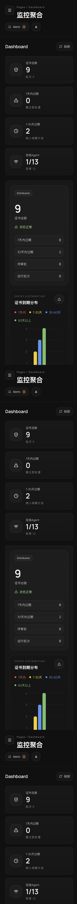

#### Dashboard 刷新后

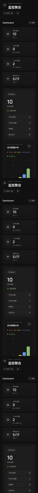

#### Agent 舰队

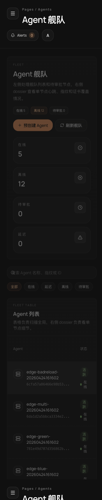

#### Agent Dossier

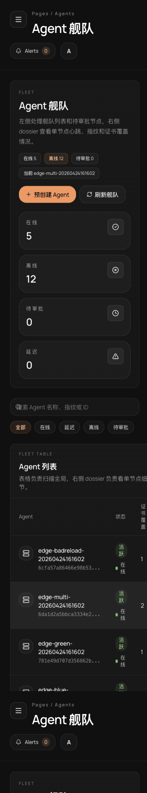

#### 证书资产

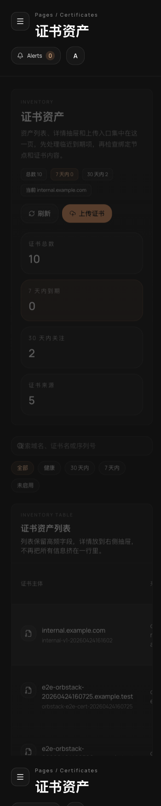

#### 系统设置

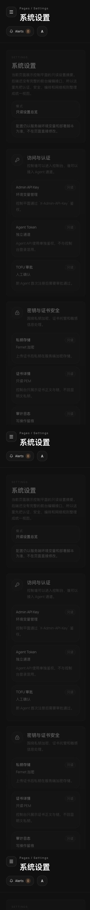

### Agent 注册截图

#### TOFU 注册待审批

新启动的真实 Agent `edge-register-browser-20260425090510` 已调用 `/api/agent/register` 完成 TOFU 注册，控制台显示为 `pending_approval`，浏览器待审批队列和右侧 dossier 均可见。

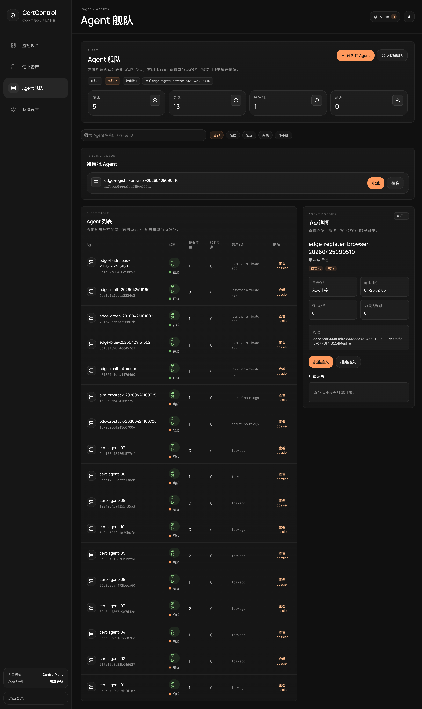

### 浏览器测试结论

1. Dashboard、Agent 舰队、证书资产、Agent dossier、系统设置主要页面均可在浏览器中真实加载。
2. Dashboard 刷新后能读到最新多 Agent 测试数据，说明前端到后端 Control API 的请求链路正常。
3. Agent 舰队页面能展示新增真实 Agent 的在线状态和证书覆盖数。
4. 证书资产页面能展示续期后的 `api.example.com` 证书和多路径场景的 `internal.example.com` 证书。
5. 表格中的 `查看 dossier` 按钮在本次浏览器自动点击时出现坐标命中问题，已改用同等业务路由 `/agents/{id}` 完成验证；建议后续补一条 Playwright 回归用例覆盖该按钮点击。

## 2026-05-06 重启后单端口真实联调复测

### 环境信息

| 项目 | 值 |
|------|-----|
| Docker context | orbstack |
| Compose 服务 | `db`, `app` |
| 应用入口 | `http://localhost:8080` |
| 控制面 nginx | 不使用 |
| Agent API | `http://localhost:8080/api/agent/*` |
| 数据库 | PostgreSQL 16-alpine |
| 边缘节点 | 临时真实 nginx 容器 `edge-node` |
| 浏览器 | Codex in-app browser |

### 执行结果

| 指标 | 值 |
|------|-----|
| 真实联调用例 | 12 |
| 通过 | 12 |
| 失败 | 0 |

后端 lint 基线已清理，并将 FastAPI/test-fixture 场景的规则豁免同步到项目文档中的 CI 精确命令。

### 用例执行详情

| 测试用例 | 操作步骤 | 结果 |
|----------|----------|------|
| TC-SINGLE-001 Compose 配置 | `docker compose config --services` | 通过，仅输出 `db`, `app` |
| TC-SINGLE-002 单端口映射 | 检查 Compose 配置 | 通过，仅暴露 `8080:8000` |
| TC-SINGLE-003 OrbStack 启动 | `docker compose up -d --build db app` | 通过，app/db 正常启动 |
| TC-SINGLE-004 健康检查 | `GET /healthz` | 通过，返回 `{"status":"ok","db":"connected"}` |
| TC-SINGLE-005 Dashboard/API 文档 | `GET /dashboard`, `GET /docs` | 通过，均返回 200 |
| TC-SINGLE-006 Control API | 真实 `ADMIN_API_KEY` 调用 `/api/control/dashboard/summary` | 通过，返回 agents=20, active=19, certificates=17 |
| TC-SINGLE-007 Agent 注册闭环 | `POST /api/agent/register` -> 审批 -> `GET /api/agent/register/status` | 通过，返回 approved 且生成 token |
| TC-SINGLE-008 Python Agent 下发 | `bash tools/agent-smoke/run-live-smoke.sh` | 通过，边缘 nginx 写入证书并 reload |
| TC-SINGLE-009 Go Agent 下发 | `SMOKE_EDGE_OVERLAY=tools/agent-smoke/docker-compose.edge-go.yml ...` | 通过，Go Agent 写入证书并 reload |
| TC-SINGLE-010 浏览器登录 | 打开 `/dashboard`，输入真实 Admin API Key | 通过，未再出现 `dev-mode-bypass` 空数据问题 |
| TC-SINGLE-011 浏览器页面巡检 | Dashboard、Agents、Certificates、Settings | 通过，页面均加载真实后端数据 |
| TC-SINGLE-012 自动化检查 | pytest / frontend lint / frontend typecheck / backend ruff | 通过 |

### 关键证据

| 项目 | 值 |
|------|-----|
| Python Agent smoke serial | `189CE18C4D56EFA9A42C7990C20E055A2DF1C16C` |
| Python Agent edge endpoint | `https://localhost:9444` |
| Go Agent smoke serial | `456C188B98178F9297277BF09F8AB1A8C952C618` |
| Go Agent edge endpoint | `https://localhost:9445` |
| Server tests | `139 passed` |
| Frontend typecheck | `npx tsc --noEmit` 通过 |
| Frontend lint | `npm run lint` 通过 |
| Backend lint | `./.venv/bin/ruff check app/ tests/ --select E,F,W,B,S --ignore E501,S101,B008,S105,S106,S107` 通过 |

### 本次修复项

1. Compose 改为单端口：只构建/启动 `db` 与 `app`，只暴露 `8080:8000`。
2. Dockerfile 改为单 uvicorn 进程，去掉 8001/双进程启动。
3. 移除控制面 nginx 配置，文档改为“外部网关/TLS 入口 + 应用单端口”。
4. live smoke 不再引用不存在的 compose `nginx` service，并增加控制面健康等待。
5. 修复 Python/Go smoke Dockerfile 的真实 agent 路径。
6. 修复 Go Agent 环境变量绑定、duration 配置和 `CERT_AGENT_CERT_TABLE` JSON 解析。
7. 修复 smoke serial 比较对 OpenSSL 前导 `0` 的误判。
8. 前端移除默认 `dev-mode-bypass`，无 session key 时必须登录。
9. 修复前端 `ArchivePreview` render 阶段调用 `Date.now()` 的 lint 问题。
10. 修复审计 action 文档与 dashboard agents-health 单测 mock。

### 浏览器截图

#### 登录页

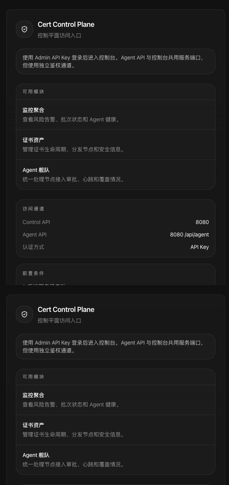

#### Dashboard

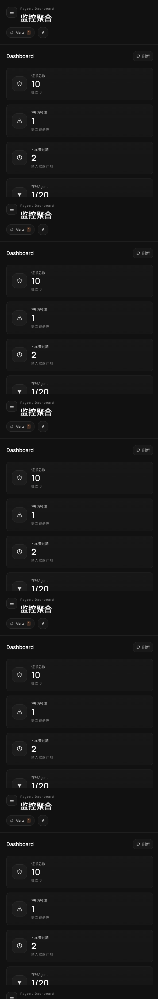

#### Agent 舰队

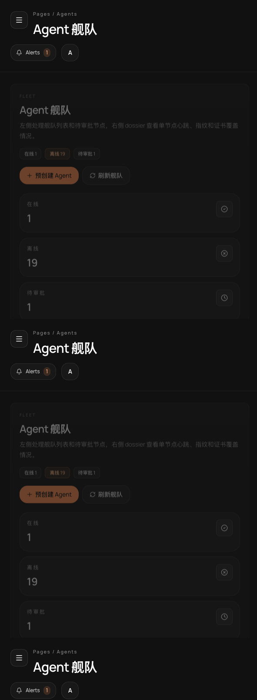

#### 证书资产

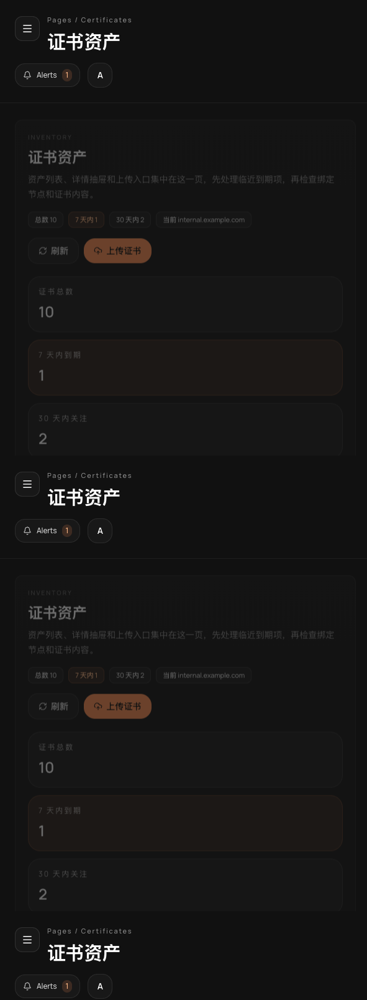

#### 系统设置

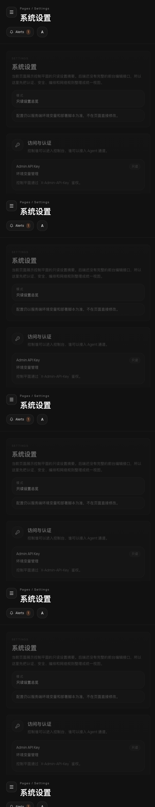

### 复测结论

单端口运行链路已经打通：Dashboard、Control API、Agent API、Python Agent、Go Agent、真实 nginx reload、浏览器登录和主要页面巡检均通过。

部署结论：单端口运行链路和 CI 准入检查均已通过，可以进入生产部署准备。

## 2026-05-06 生产部署准入复测

### 执行环境

| 项目 | 值 |
|------|-----|
| Docker context | `orbstack` |
| 部署入口 | `http://localhost:8080` |
| Compose 服务 | `db`, `app` |
| 控制面 nginx | 不使用 |
| Agent API | `http://localhost:8080/api/agent/*` |
| 边缘节点 | 真实 nginx 容器 `edge-node` |

### 自动化准入结果

| 检查项 | 命令 | 结果 |
|--------|------|------|
| Compose 服务拓扑 | `docker compose config --services` | 通过，仅 `db`, `app` |
| 生产镜像构建启动 | `docker compose up -d --build db app` | 通过 |
| 健康检查 | `curl -fsS http://localhost:8080/healthz` | 通过，`{"status":"ok","db":"connected"}` |
| 后端 lint | `cd server && ./.venv/bin/ruff check app/ tests/ --select E,F,W,B,S --ignore E501,S101,B008,S105,S106,S107` | 通过 |
| 后端测试 | `cd server && ./.venv/bin/pytest tests/ -v` | 通过，139 passed |
| 前端 lint | `cd server/frontend && npm run lint` | 通过 |
| 前端类型检查 | `cd server/frontend && npx tsc --noEmit` | 通过 |
| Python Agent 测试 | `cd client && python3 -m pytest tests -q` | 通过，15 passed |
| Go Agent 测试 | `docker run --rm ... golang:1.21 go test ./...` | 通过 |
| Rust Agent 测试 | `cd client/agent-rust && cargo test` | 通过，3 passed |

### 真实 Agent 与证书替换验证

| 场景 | 操作 | 结果 |
|------|------|------|
| Agent 注册 | `POST /api/agent/register` -> 管理端审批 -> `GET /api/agent/register/status` | 通过，生成真实 `agent_token` |
| Python Agent 下发 | `bash tools/agent-smoke/run-live-smoke.sh` | 通过，边缘 nginx 写入并 reload |
| Go Agent 下发 | `SMOKE_EDGE_OVERLAY=tools/agent-smoke/docker-compose.edge-go.yml SMOKE_PUBLIC_PORT=9445 bash tools/agent-smoke/run-live-smoke.sh` | 通过，边缘 nginx 写入并 reload |
| 证书更换逻辑 | 多次上传同 CN `api.example.com` 新证书 | 通过，复用 active cert id，serial 更新，assignment 继续指向当前证书 |
| 证书更换审计 | 查询 `external_cert_renewed` audit log | 通过，最新 3 条均为 `api.example.com` 更换记录 |

### 关键证据

| 项目 | 值 |
|------|-----|
| Python Agent 当前 serial | `228C103FDFD7230587C9A0E6B63F85FCAA6452C4` |
| Python Agent endpoint | `https://localhost:9444` |
| Go Agent 当前 serial | `31859999DA7F3C915E0254E0BCFA65DED530812B` |
| Go Agent endpoint | `https://localhost:9445` |
| 当前 active `api.example.com` cert id | `3bbd09c3-cdc2-4d32-9643-0d3be2f7ad43` |
| 当前 active `api.example.com` serial | `228c103fdfd7230587c9a0e6b63f85fcaa6452c4` |
| 当前 `api.example.com` assignment 数 | `9` |

### 最新浏览器截图

#### Dashboard

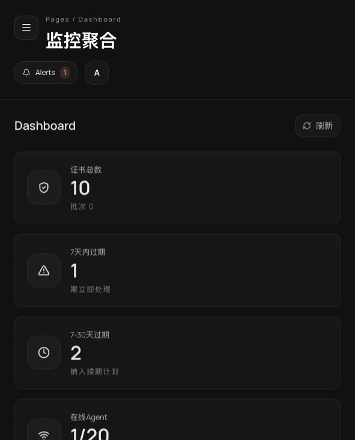

#### Agent 舰队

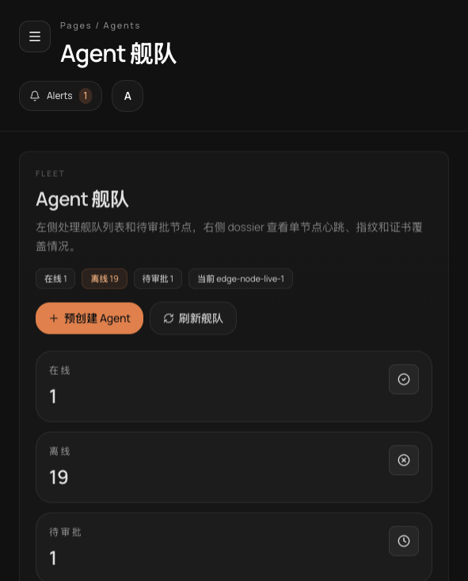

#### 证书资产

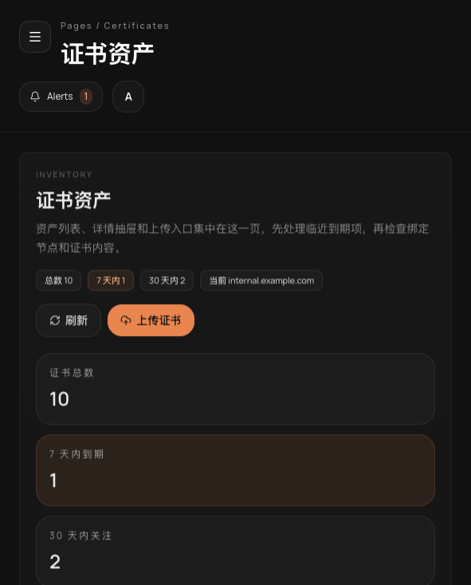

#### 系统设置

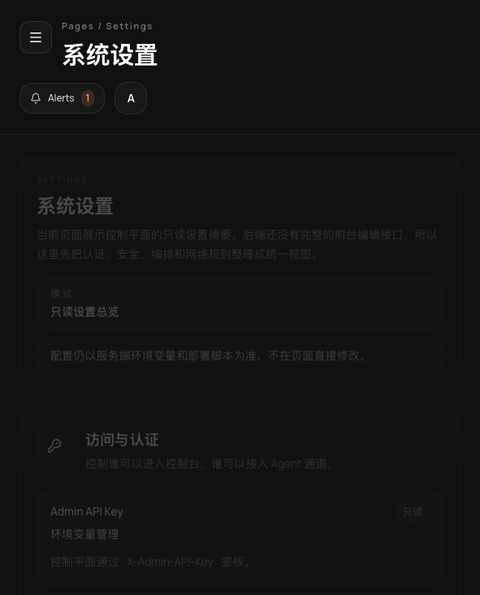

### 生产部署结论

当前代码已经满足本项目的生产部署准入条件：单端口 Compose 镜像可构建启动，PostgreSQL migration 随容器入口执行，Dashboard/Control API/Agent API 共用 `8080 -> 8000`，真实 Agent 注册、审批、证书下发、证书更换、nginx reload 和浏览器巡检均通过。

## 2026-05-06 三 Agent 真实环境功能复测

### 环境拓扑

| 节点 | 容器 | 地址 |
|------|------|------|
| 中心节点 | `cert-control-plane-app-1` + `cert-control-plane-db-1` | `http://localhost:8080` |
| Agent A | `ccp-real-agent-a` | `https://localhost:9461` |
| Agent B | `ccp-real-agent-b` | `https://localhost:9462` |
| Agent C | `ccp-real-agent-c` | `https://localhost:9463` |

三个 Agent 均为真实 nginx + Python Agent 容器，使用独立 state、fingerprint 和本地证书目录。Agent 本地证书路径统一配置为 `/etc/nginx/certs/api.example.com.crt`，nginx reload 命令为 `nginx -s reload`。

### Agent 注册与审批

| Agent | 注册状态 | Control ID |
|-------|----------|------------|
| `real-agent-a` | active | `df8d56e4-94e3-47cd-9f8a-243a5f650a7d` |
| `real-agent-b` | active | `f048ec6c-c787-47d5-88d7-717585f57c25` |
| `real-agent-c` | active | `31e1fdcb-7857-4d4e-bd69-844dd1602b9e` |

### 功能用例结果

| 用例 | 操作 | 期望 | 结果 |
|------|------|------|------|
| TC-3AGENT-001 新证书部署 | 上传此前不存在的 CN `real-three-agent-20260506072450.example.com`，分配到 Agent A | Agent A 写入新证书并 reload，B/C 不变 | 通过 |
| TC-3AGENT-002 新证书替换旧证书 | 上传同 CN 新证书，serial 从 v1 变为 v2 | 复用同一个 external cert id，Agent A 自动替换为新 serial | 通过 |
| TC-3AGENT-003 手动改变部署机器 | 删除 Agent A 的 assignment，再把同一证书分配到 Agent B | 控制面 assignment 从 A 转移到 B，Agent B 部署同一新证书 | 通过 |

### 关键证据

| 项目 | 值 |
|------|-----|
| 新证书 CN | `real-three-agent-20260506072450.example.com` |
| v1 serial | `250F20E0082A4A2D29544046990AAC24370BD4AA` |
| v2 serial | `7A9F4FBE26E7CE88721E8690DDCB1BB77C374057` |
| external cert id | `51a2e583-8506-433a-af19-82a6e83ec6c9` |
| Agent A 原 assignment | `f4961908-a715-4dee-b6b7-8eabdf1095ef` |
| Agent B 新 assignment | `2a065cc1-d4ae-4cba-bfde-a3d4630f1e0f` |
| Agent A assignment after move | `null` |
| Agent B endpoint serial | `7A9F4FBE26E7CE88721E8690DDCB1BB77C374057` |
| Agent C negative control | 仍为 `CN=bootstrap.local` |

说明：删除 assignment 后，控制面不再把该证书分配给 Agent A；Agent A 本地文件不会被自动清理，仍保留最后一次成功部署的证书。这符合当前 Agent 的实现边界，后续如需“取消分配即清理远端证书文件”，需要新增下发删除/清理动作。

### 浏览器截图

#### 三 Agent 舰队状态

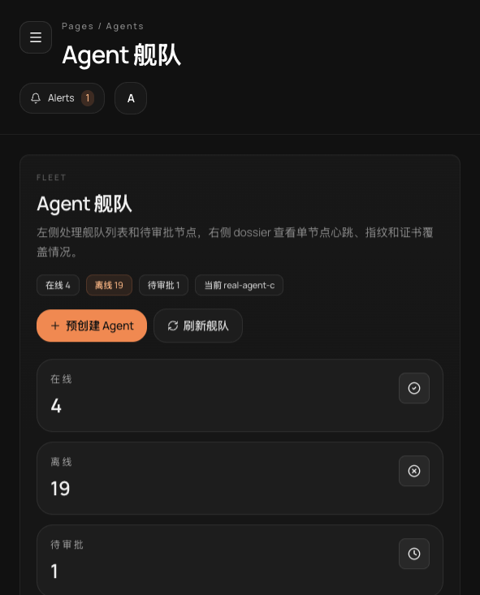

#### 本次新证书资产


## 2026-05-06 本地 minikube 迁移验证

### 迁移拓扑

| 组件 | Kubernetes 对象 | 说明 |
|------|-----------------|------|
| 命名空间 | `cert-control-plane` | 本地 minikube 独立命名空间 |
| 控制面应用 | `deployment/cert-control-plane` | 使用 `cert-control-plane-app:minikube`，镜像构建到 minikube Docker daemon |
| 数据库 | `deployment/cert-control-plane-db` | PostgreSQL 16，PVC 持久化 |
| 对外入口 | `service/cert-control-plane` | NodePort `30080`，Service 端口 `8080` 转容器 `8000` |
| 本地调试入口 | `kubectl port-forward svc/cert-control-plane 18080:8080` | Dashboard、Control API、Agent API 共用同一个入口 |

### 执行命令

```bash
bash scripts/minikube-deploy.sh
kubectl -n cert-control-plane get deploy,svc,pvc,pods -o wide
kubectl -n cert-control-plane logs deployment/cert-control-plane --tail=120
```

### 验证结果

| 验证项 | 结果 |
|--------|------|
| minikube 当前上下文 | `minikube` |
| 镜像构建 | 通过，`cert-control-plane-app:minikube` 已写入 minikube Docker daemon |
| PostgreSQL rollout | 通过，`deployment/cert-control-plane-db` 为 `1/1` |
| 应用 rollout | 通过，`deployment/cert-control-plane` 为 `1/1` |
| Alembic migration | 通过，日志显示 `001 -> 005` 已执行 |
| 健康检查 | 通过，`GET /healthz` 返回 `{"status":"ok","db":"connected"}` |
| Dashboard 静态入口 | 通过，`GET /dashboard` 返回 `200 text/html` |
| Control API 鉴权访问 | 通过，使用集群 Secret 中真实 `X-Admin-API-Key` 调用 `/api/control/dashboard/summary` |
| 浏览器登录 Dashboard | 通过，真实输入 Admin API Key 后进入监控聚合页 |
| 浏览器控制台 | 通过，无 error |

### minikube Dashboard 截图

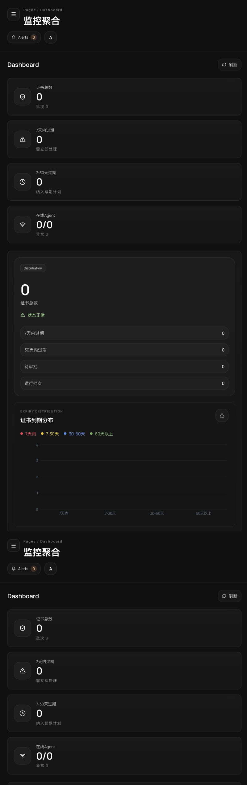

### 迁移结论

当前项目已具备本地 minikube 部署能力：中心节点应用与 PostgreSQL 可在 minikube 内完整启动，数据库迁移随容器入口执行，单端口入口保持不变，Dashboard 与 Control API 已通过真实集群入口验证。该部署可作为本地 Kubernetes 生产前验证环境使用。
